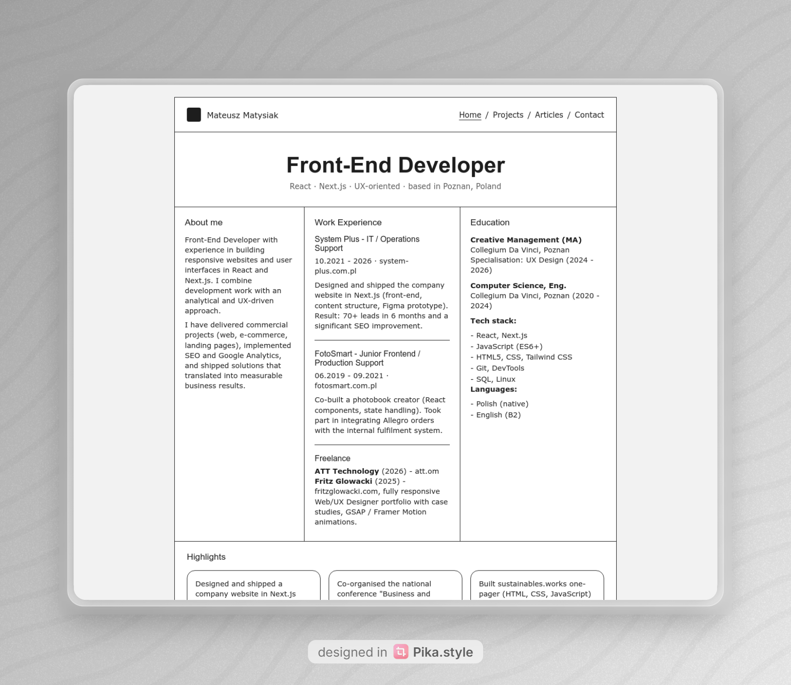

# Basic HTML Website

This project is my implementation of the roadmap.sh challenges:

- https://roadmap.sh/projects/basic-html-website
- https://roadmap.sh/projects/portfolio-website

It is part of my personal series of roadmap.sh projects where I test and strengthen my understanding of legacy-style web fundamentals while also applying newer vanilla HTML, CSS, and JavaScript techniques.

The visual direction is inspired by the look of prototype-style interfaces from Balsamiq:

https://balsamiq.com/

## Live Demo

- Demo: https://basic-html-website-cyan-six.vercel.app/
- Repository: https://github.com/Matysiak-Mateusz/Basic-HTML-Website

## Preview

## About The Project

This is a multi-page portfolio website built with semantic HTML and vanilla CSS. The project includes:

- a homepage
- a projects page
- an articles page
- a contact page
- a shared navigation across all pages
- SEO meta tags
- favicon support
- accessibility improvements based on WCAG 2.1-oriented practices

The main goal of this project was to keep the structure simple and readable, while building a solid foundation that can be extended later with more styling and JavaScript interactions.

## Why I Built It

I use roadmap.sh projects to verify my practical knowledge, especially around classic multi-page website structure and older web patterns that still matter in real-world work. At the same time, I use these exercises to practice a more modern approach to vanilla CSS, HTML, and progressive front-end implementation.

## Tech Stack

- HTML5
- Vanilla CSS
- Static multi-page architecture
- Vercel for deployment

## Notes

Although this project stays intentionally simple, it was built with attention to semantic structure, accessibility, maintainability, and deployment readiness.
